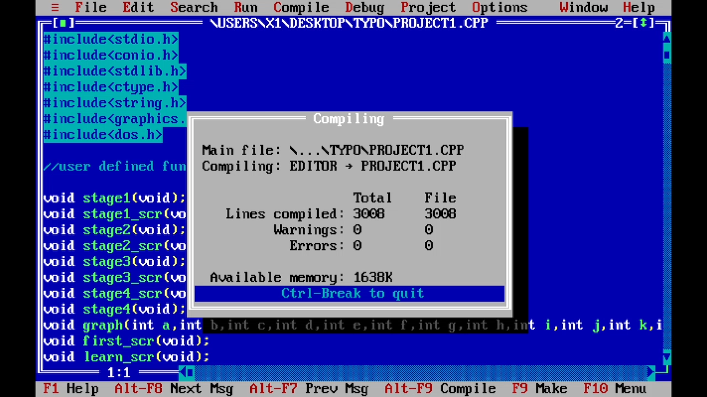
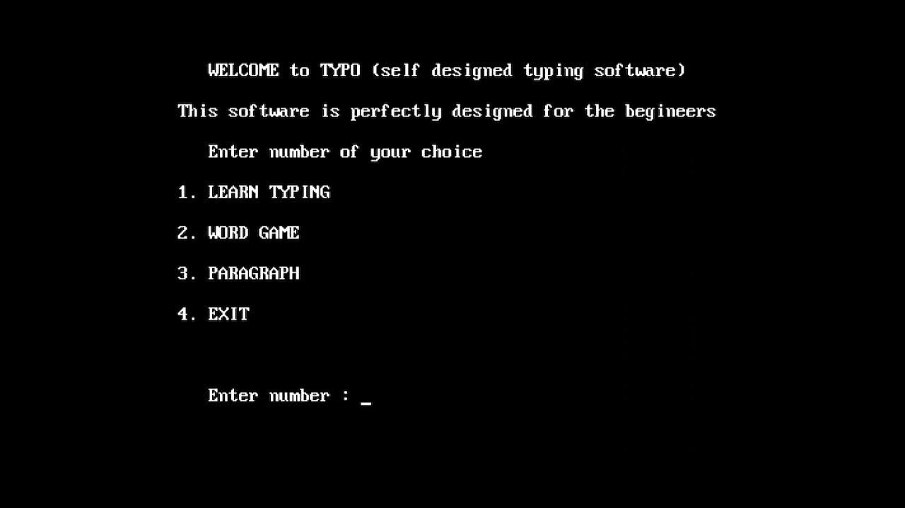
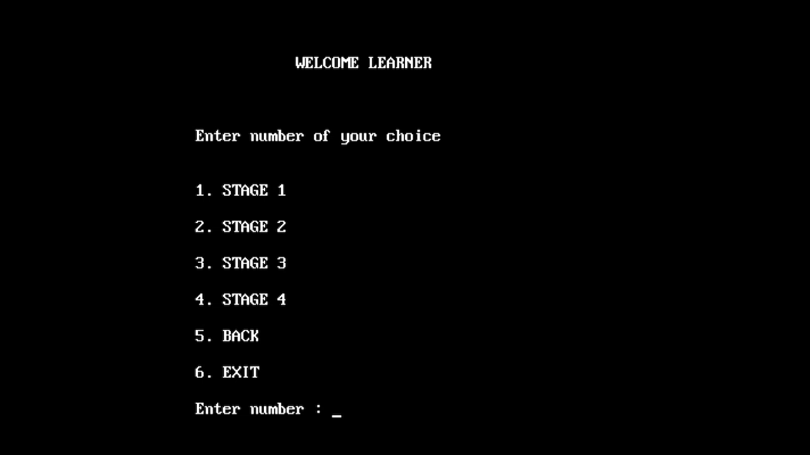
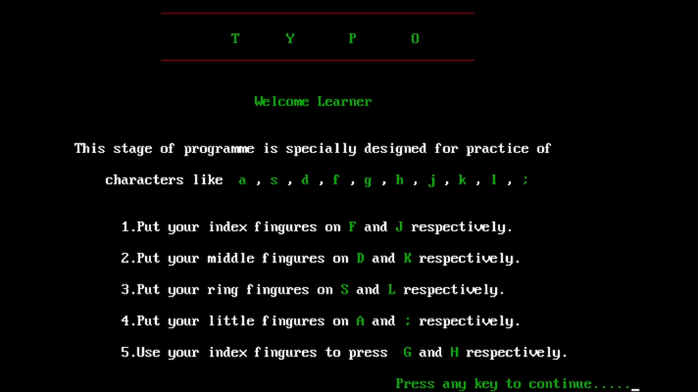
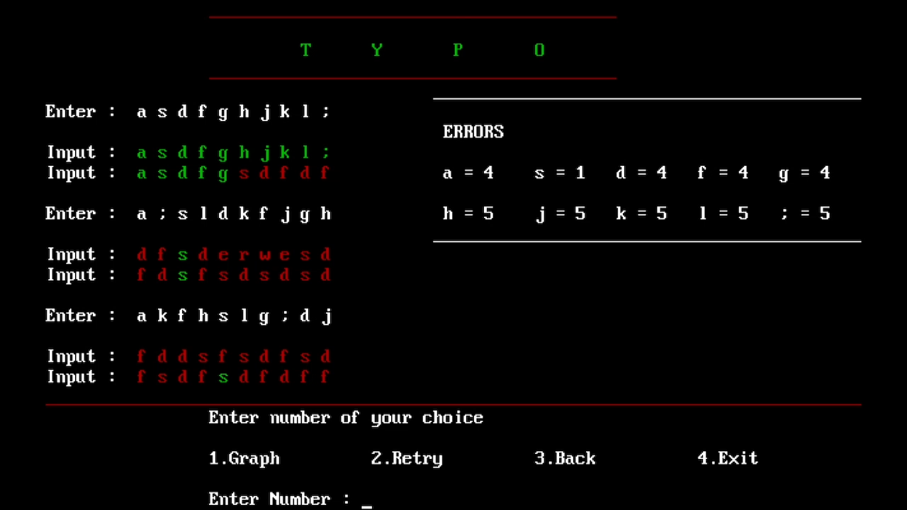
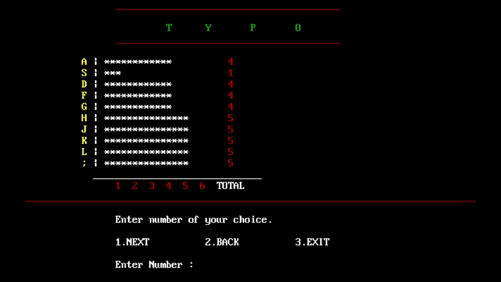
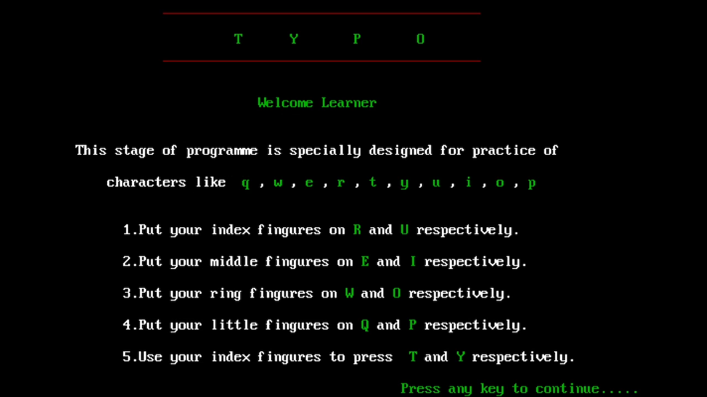
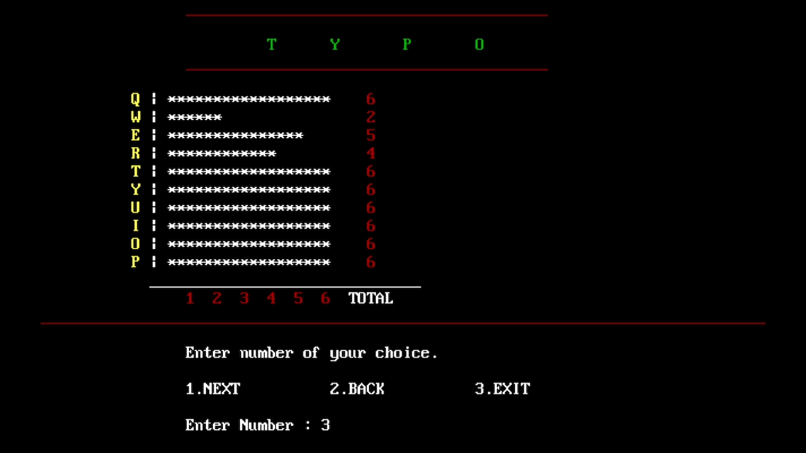
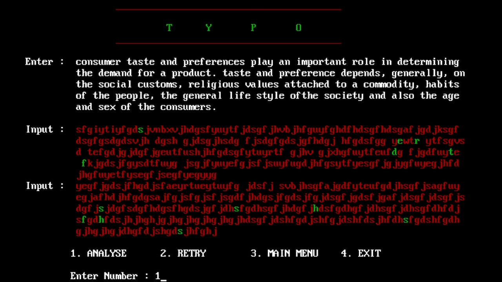
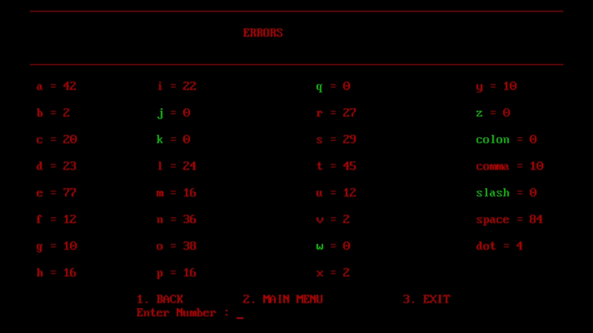

<h3 align="center">TYPO</h3>

---

<div align="center">

[](https://github.com/novicexp/typo-learn)

 

</div>

---

## 📝 Table of Contents

- [About](#about)
- [Getting Started](#getting_started)
- [Screenshots](#screenshots)

## 🧐 About <a name = "about"></a>

A simple typing learning software in `c` language for begineers :)

## 🏁 Getting Started <a name = "getting_started"></a>

- clone project
  ```
  git clone https://github.com/novicexp/typo-learn
  ```
  ```
  cd typo-learn/
  ```

- `open in Turbo C++`

- `compile & run`

---

**Note :-** Tested on `Windows 10` using `Turbo C++`

---

## Screenshots <a name = "screenshots"></a>

<p align="center">

</p>

<p align="center">

</p>

<p align="center">

</p>

<p align="center">

</p>

<p align="center">

</p>

<p align="center">

</p>

<p align="center">

</p>

<p align="center">

</p>

<p align="center">

</p>

<p align="center">

</p>

---

Dev Period :- `August 2019`

Team :- `Me` and `one of my friend`

---

<p align="center">
Thanks :)
</p>